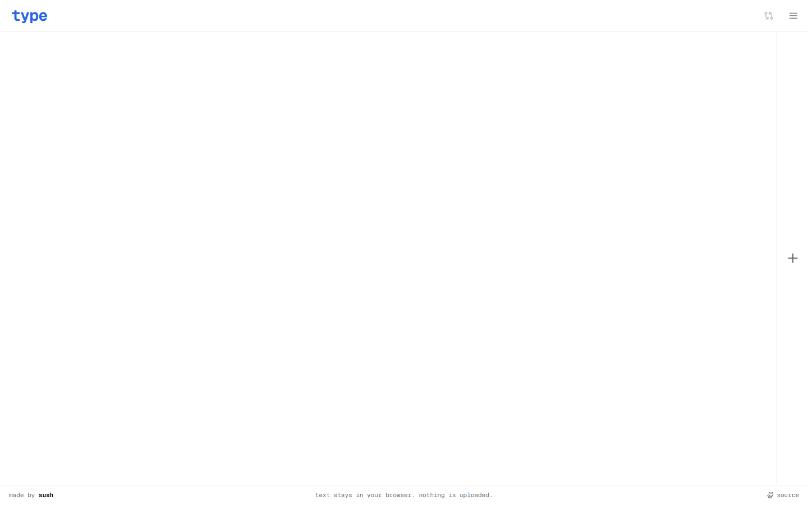

# type

type, format, compare, copy. nothing else.

`type` is a text scratchpad that is ready to type into the instant it loads. paste something in, run a format over it, compare it with another editor, copy it back out. there is no account, no backend and no request to anything before you interact. your text stays in your browser.

live at [type.sush.dev](https://type.sush.dev).



## features

- the first textarea is focused and typeable at first paint
- up to 8 editors side by side, each with its own title
- 26 formats in four groups: case, lines, wrap, encode (see [docs/formats.md](docs/formats.md))
- command palette (`mod+k`) that searches formats and app commands
- compare any two editors with a git-style diff, split or unified, with word-level highlights
- live stats: chars, words, lines, sentences, reading time
- copy the whole editor in one click or one shortcut
- system themes plus six VS Code-inspired palettes, with three accents and no flash on reload
- mono, serif or sans editor font, loaded only when picked
- everything persists in localStorage and survives a reload
- keyboard first: every action has a shortcut, `?` lists them

## keyboard shortcuts

`mod` is `ctrl` on windows and linux, `cmd` on mac.

| keys          | action              |
| ------------- | ------------------- |
| `mod+k`       | command palette     |
| `mod+shift+n` | new editor          |
| `mod+shift+w` | close active editor |
| `mod+shift+c` | copy active editor  |
| `mod+shift+d` | compare editors     |
| `mod+shift+u` | uppercase           |
| `mod+shift+l` | lowercase           |
| `mod+shift+t` | title case          |
| `mod+shift+j` | json pretty         |
| `mod+/`       | toggle theme        |
| `alt+1…8`     | focus editor 1–8    |
| `?`           | keyboard shortcuts  |
| `esc`         | close overlay       |

native `ctrl+c`, `ctrl+v`, `ctrl+z` and friends are never overridden. more in [docs/shortcuts.md](docs/shortcuts.md).

## fonts and themes

- fonts: geist mono (default), newsreader (serif), space grotesk (sans). only geist mono ships on the critical path; the others load when you pick them.
- themes: system, light, dark, dark modern, light modern, monokai, solarized dark, quiet light and abyss. switching animates with a circular reveal, or happens instantly under `prefers-reduced-motion`.
- accents: blue, red, green. the accent drives focus rings, the wordmark, active states, diff highlights and text selection.
- icons: phosphor.

see [docs/theming.md](docs/theming.md).

## privacy and analytics

your text never leaves the browser. editors and settings live in localStorage under `type:editors` and `type:settings`. there is no backend.

google analytics 4 is optional and off by default. to turn it on, set `VITE_GA_MEASUREMENT_ID` (see `.env.example`). when set, the gtag script loads only after your first interaction, respects do not track, uses `anonymize_ip`, and never receives editor content. the only things sent are event names like `format`, `copy`, `compare_open`, `add_editor` and `font`, with coarse parameters such as which format id was used.

## quick start

requires node 20 or newer (`.nvmrc` says 24) and pnpm 10.

```sh
git clone https://github.com/sushilburagute/type.git
cd type
corepack enable pnpm   # or: npm i -g pnpm
pnpm install
pnpm dev
```

## scripts

| script               | what it does                                        |
| -------------------- | --------------------------------------------------- |
| `pnpm dev`           | start the vite dev server                           |
| `pnpm build`         | typecheck (`tsc -b`) then build to `dist/`          |
| `pnpm preview`       | serve `dist/` on port 4173                          |
| `pnpm lint`          | eslint                                              |
| `pnpm format`        | prettier, write                                     |
| `pnpm format:check`  | prettier, check only                                |
| `pnpm typecheck`     | `tsc -b --noEmit`                                   |
| `pnpm test`          | vitest, single run                                  |
| `pnpm test:watch`    | vitest in watch mode                                |
| `pnpm test:coverage` | vitest with v8 coverage and thresholds              |
| `pnpm e2e`           | playwright against the production build (see below) |
| `pnpm e2e:ui`        | playwright ui mode                                  |
| `pnpm size`          | check the entry chunk against the bundle budget     |

## project layout

```
src/
  components/   one component per folder, colocated *.test.tsx
  constants/    formats, shortcuts, fonts, accents, limits, storage keys
  hooks/        editor content, shortcuts, theme, fonts, clipboard, view transitions
  store/        zustand stores: editors, settings, ui, migrations
  types/        shared types: editor, settings, format, diff, shortcut
  utils/        pure functions: text formats, diff, storage, analytics, clipboard
  styles/       index.css (tailwind + tokens), theme.css, fonts.css, transitions.css
  test/         vitest setup and mocks
e2e/            playwright specs, run against `vite preview`
docs/           architecture, formats, shortcuts, theming, performance
plan/           the approved implementation plan
scripts/        check-bundle-size.mjs
```

more in [docs/architecture.md](docs/architecture.md).

## stack

vite 8, react 19, typescript (strict), tailwind css v4, zustand 5, jsdiff 9, vitest 5 with testing library, playwright, eslint flat config with prettier, pnpm 10. deployed on vercel as a static spa.

## deploying

the site is a static build; any static host works. on vercel:

1. import the repo. the framework preset is vite and `vercel.json` sets the build command, output directory, spa rewrite and cache headers.
2. optionally add the `VITE_GA_MEASUREMENT_ID` environment variable. leave it unset to ship without analytics.
3. deploy.

## performance budget

the entry chunk must stay at or below 95 kb gzipped; `pnpm size` fails the build otherwise. react-dom is around 70 kb of that. the compare view, command palette and shortcuts sheet are lazy chunks, and jsdiff lives only in the compare chunk. no third-party request is made before the first interaction. see [docs/performance.md](docs/performance.md).

## contributing

issues and pull requests are welcome. read [CONTRIBUTING.md](CONTRIBUTING.md) first; it covers setup, the pr checklist and how to add a format or a shortcut.

## license

[mit](LICENSE), © 2026 sush.

made by [sush](https://sush.dev)
